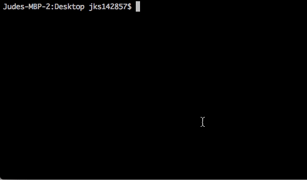

# Haiphen 
<br>https://haiphenai.com<br> 

[](https://bestpractices.coreinfrastructure.org/projects/569)<br>


----
"Create your own traceable digital-copyright"<br><br>
**Haiphen**: a low level binary file to 'stamp' your docker-image with an encrypted, digital copyright \[patent pending\]. A community of developers, leveraging this tool, will be able to selectively and securely share pertinent API data with eachother. End users using the tool will have single entry point access point to all of their 3rd party software (easier to manage, make payments, audit, etc.) All copy-rights are secured on an immutable, decentralized blockhain ([filecoin](https://filecoin.io/))   
   

### Install <a name="install"></a>
*_Requirements_*: You should have the following installed on your machine:
- [homebrew](https://brew.sh/) 
- [docker](https://www.docker.com/get-started)
- [reactjs-boilerplate](https://www.npmjs.com/package/reactjs-boilerplate)
- [macosx terminal](https://github.com/sickcodes/Docker-OSX) <br>

Navigate to [command-line](https://support.apple.com/guide/terminal/open-or-quit-terminal-apd5265185d-f365-44cb-8b09-71a064a42125/mac) on your machine and enter the following commands:<br>
```
$ brew tap JudeSafo/homebrew-testtap
$ brew install digital-copyright
```
Alternatively you can clone this repot `git clone https://github.com/JudeSafo/digital-copyright/` and run: 
```
$ cd digital-copyright
$ mv haiphen \usr\local\bin\haiphen
```
If succesfull test installation by typing `haiphen` and confirming it returns

```
Examples:
    # Create a test file [test.txt]
    echo "This is a Test." > test.txt
    # Generate a Key and save it to file [encryption.key]
    ...
```
### Create a test docker image <a name="create_docker_image"></a>
```
$ reactjs-boilerplate test_docker_image
...
$ docker compose up -d
$ docker build -t test_docker_image

```
### Run Haiphen to stamp your license <a name="stamp_haiphen_license"></a>

Navigate to the \<path\> where your current `license` is saved and enter the following:
```
$ haiphen -e -i License -o LICENSE_sha256hash.enc
```
Confirm that your (chrome) browser opens to confirm the encrypted license has been written to the filecoin blockchain at the new [hash-address](/https://ipfs.infura.io/ipfs/) 

### Deploy docker image and monitor <a name="deploy_docker"></a>
1. deploy your image
```
$ docker run test_docker_image
```
3. ...
4. (In progress) Open the [chrome extension](https://github.com/JudeSafo/digital-copyright) to `ping` haiphen for metadata on your api (e.g. end-point users, tags, traffic, connected APIs)

<br><br>
#### Demo (placeholder)

